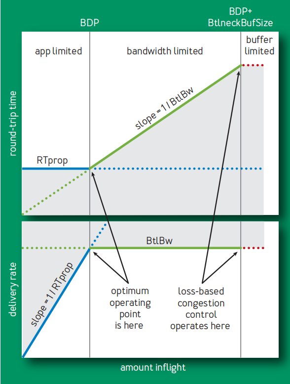
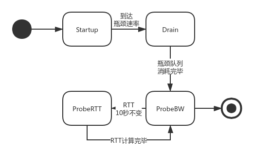

阅读了有关BBR的文章[1]，感觉深受启发，遂写一篇总结的文章。

# 何为基于拥塞？

作者们取的这个题目（Congestion-Based Congestion Control)首先勾起了我的兴趣。我快速的在脑里面复习前段时间刚刚在TCP/IP卷一中学习的有关拥塞控制的机制和算法：快速重传，拥塞避免（Congestion Avoidance），记得就这俩。

快速重传基于3次或多次的重复ACK，得知接收方没有收到重复ACK指示的分组，因此很有可能发生了丢包。而拥塞避免则是在达到最大的拥塞窗口时，不断的上探能不能扩大窗口，发现丢包的时候立即回到原本的窗口。因此，这两个算法，都是基于丢包的拥塞控制。

但是，文章指出，随着网卡设备从Mbps到Gbps级别的转变，内存从KB到GB的转变，丢包与拥塞的关系变得不再像以往那么紧密了。文章没有指出为什么，我想是因为队列能够容纳的分组越来越多，因此因为队列满而导致丢包的现象会减少，但同时排队时延变得很长，意味着拥塞现象仍然存在。但是，基于丢包的拥塞控制算法无法检测出来。

非但如此，基于丢包的拥塞控制算法还是拥塞的罪魁祸首（真讽刺）。由于在没有发生丢包的时候，算法普遍会上探拥塞窗口的值，导致发送越来越多的分组，但是由于发送的速率其实并没有多少变化（下面核心思想中会继续阐述这点），因此排队的分组将会越来越多，最终导致超长时间的拥塞。

为了修复这个历史遗留问题，文章提出基于拥塞的拥塞控制算法。基于拥塞的算法，说明BBR确实能够发现已经存在的拥塞情况，并且使用了比丢包这个指标要有效的指标来发现拥塞，不然不可能这么起名字。事实上还真的是。

# 核心思想

## 拥塞特征

要发现拥塞，首先就要了解其特征。文章指出， **在任何时候，一条全双工的TCP连接中，在一个方向上有且仅有一个最慢的链路，也就是瓶颈链路。** 不难理解，最慢的链路决定了整条链路的速度。瓶颈链路重要在

- 其决定了整条链路的传输速度。
- 其上面排队了所有因发送速率高于传输速率而多出的分组。排队是因为发送的速率低于接收的速率。很显然，上游的链路的发送速率是高于接收速率的（不然就是瓶颈了），因此分组不会在那里排队。而瓶颈这里，由于发送速率基本不变了，而接收速率却在增大（因为拥塞控制的窗口上探），因此队列就在这里产生了。按文章的说法，就是上游链路的队列转移到了瓶颈链路。

## 核心指标

无论TCP链路怎么变，其都可以看成一条拥有同样传输速率和RTT（Round-Trip Time）的链路。算法依赖的核心指标就是这两个

- *RTProp*：Round-Trip Propogation Time，是单个分组的往返所需时间。
- *BtlBW*：Bottleneck Bandwidth，是瓶颈链路带宽

这两个变量也是算法名称BBR的来源。通过下图来了解两者与拥塞的关系。

上方是传输中分组（inflight）与RTT的关系。当应用程序限制了发送数量的时候，也就是链路能够处理所有流量的时候，RTT会等于RTProp。但是，当分组数量超过RTProp与1/BtlBw的交点（或者发送速率大于瓶颈速率）时，将会在瓶颈链路处开始排队，拥塞产生，此时引入了排队时延，因此RTT开始上升，直到缓存被耗尽，开始丢包，RTT不再变化（不算丢包的分组的话）。

为什么是线性的上升呢？这里假定是发送速率恒定，也就是窗口是恒定的。所有的分组来到瓶颈处都需要排队，每个分组的排队时延由队列长度决定。由于瓶颈处发送速率恒定，队列的消耗速率恒定，但是队伍的补充是由一个到达接收方的分组，触发接收方发送ACK到发送方，然后发送方继续发送才补充的。因此基本上接近队列发送一个，就接收一个的情况，因此队列长度基本不变，排队时延也就不变了。

下方的图，则是传输中分组与传输速率的关系。可以看到，当链路资源充足（瓶颈在应用处）的时候，传输速率其实是由发送多少决定的。但是当速率上去时，最终还是会达到BtlBW的速率，并且不会再改变了。链路速率无法突破，多出来的分组就会去排队了。

## 交点含义

我们可以在图中看到两个交点。其中，右侧的交点是当前基于丢包的拥塞控制算法的运行点。其拥塞窗口的不断上探，队列越来越满，以至于丢包的时候才会回退。可以看到，其不仅造成了网络拥堵，还提高了RTT。

最优的操作点应该是左侧的交点，称为Bandwidth Delay Product(BDP)。在这一点上，不仅能够达到最大的速率，还避免了链路中拥塞的情况，同时也确保RTT在一个最小的值附近。要是全天下都部署了BBR，还会有拥塞的情况吗？

不过，文章说，以前的研究[2]认为左侧点不可能使用分布式的算法接近，因此大家的研究方向就往右侧点上去了。这真是祸害不浅啊。

## 指标计算

RTprop是来回传输时间的最小值，实际上我们测量到的RTT会包含各种噪音，因此我们很难测出准确的值。BBR算法的测算，是通过发送少量分组（4个），计算其最小的RTT，来获取RTProp的近似估计值。

而瓶颈速率，则直接取我们传输速率的最大值即可。因为传输不可能超过瓶颈速率。

# 算法执行状态图

确定了这两个变量之后，接下来就是要通过发送分组，查看ACK携带的信息，来估计这两个值。在没有异常情况时，算法的状态转移如下。

## Startup状态

首先，开始传输时，进入Startup状态。在这个状态之中，算法需要快速上探获得第一次测量的瓶颈速率。由于当前网络设备速率最高达到10的12次方级别，因此使用指数（倍数为2/ln2)上涨方式获取最大值，加上二分搜索的方式获取瓶颈值。

为了能够准确的查找到瓶颈，BBR算法使用三次计算来确认。仅当3次上探的尝试只带来些许的速率增长（低于25%）时，认为当前到达了瓶颈速率。进行3次，是为了给机会能够让接收方的窗口调节算法适应这个新的速率，扩大接收窗口，以提高接收速率。第一次提高速率，接收方发现，然后扩大窗口，第二次发送方填满这个窗口，第三次发送方就能够探测到这次速率的上升。

在Startup状态中，由于有一部分时间会超过瓶颈速率，因此在瓶颈处产生队列。因此为了缩减这个队列，在Startup状态结束后，进入Drain状态。

## Drain状态

为了快速缩短队列长度，其使用了上升过程中的倍数的倒数值计算传输间隔，发送新的分组。这个速率将会低于瓶颈值，从而缩减队列。

## ProbeBW状态

ProbeBW状态是在算法稳定运行时绝大多数（98%）时间所处的状态。

在这个状态中，瓶颈带宽有可能会改变。为了试探是否有更多的瓶颈带宽，算法将周期性的进行上探。原本，算法大约每隔一个RTProp发送一次分组，，但是具体由一个叫pacing_gain的变量确定，具体算式为 `nextTime = now + packet.size / (pacing_gain * BtlBW)` 。并且pacing_gain以`5/4,3/4,1,1,1,1,1,1`的周期进行变化。因此，在pacing_gain为5/4时，下一次发送的时间将会变短，单位时间内发送的分组将会变多，也就是发送速率上探，如果接收到的分组，其RTT没有太大的变化，说明上探成功。但是如果测量到RTT增大，说明当前瓶颈速率不变，需要保持当前速率。而3/4时，就用于缩短因为上探失败而累积的队列。

## ProbeRTT状态

从第一幅图中我们看到，要准确测量瓶颈带宽，需要到BDP右边。但是同时，RTT将会带有排队时延，因此无法较为准确测量RTProp。

因此，BBR会以最短200ms，或者一个RTProp的时间内，发送极少量的分组（4个），测试新的RTProp的值。测试完成后，即返回ProbeBW状态。

这个时间的选取，是为了尽可能的减少只发送少量分组的时间。因为RTProp的值会在10秒内有效，因此至少200毫秒的时间，最优情况下仅需占用2%的时间。

# 总结

随着网络设备的升级，以前基于丢包的拥塞控制算法已经显现出其劣势了。现在看到了基于RTProp和BtlBw的BBR的出现，给了另外的一大拥塞控制思虑。BBR我也用过，效果确实是不错的。希望有朝一日能够成为必须的算法来部署，减缓一下网络拥塞吧。

# 参考文献

[1] Neal Cardwell, Yuchung Cheng, C. Stephen Gunn, Soheil Hassas Yeganeh, Van Jacobson. BBR Congestion-Based Congestion Control. ACMQueue. 2016.09.
[2] Jaffe, J. 1981. Flow control power is nondecentralizable.
IEEE Transactions on Communications 29(9): 1301–1306.
